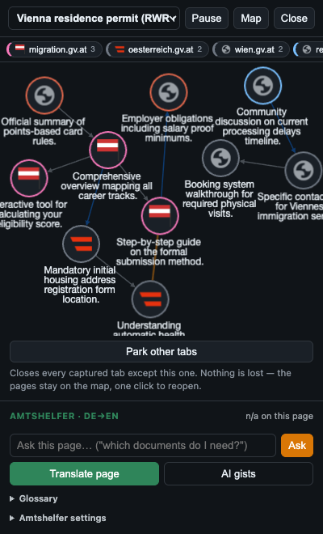
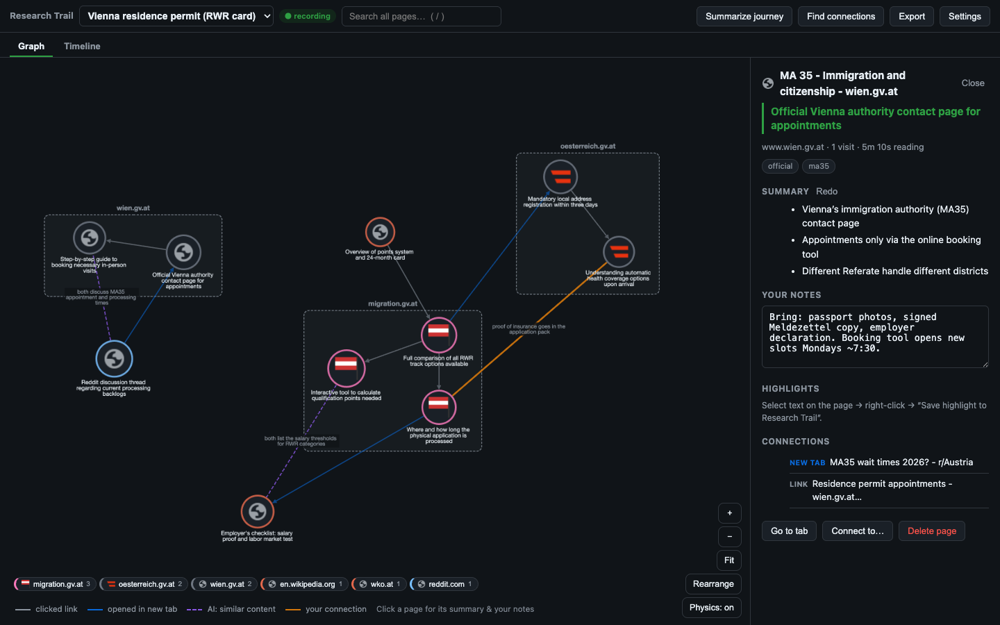
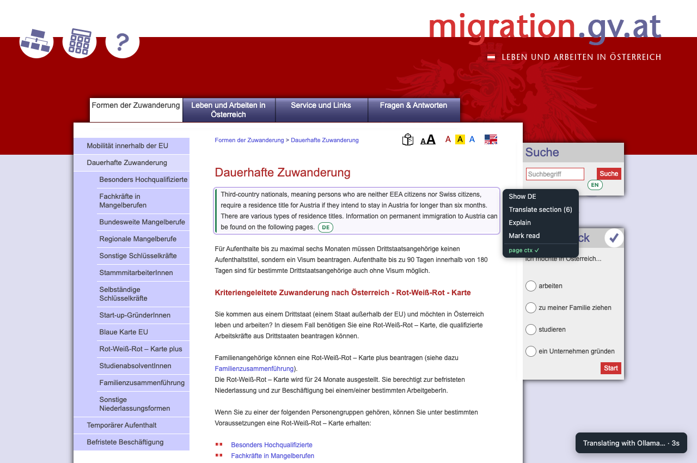

# 🧭 Research Trail

> **What this is:** a personal tool, built to scratch my own itch (in my case: untangling Austrian residence-permit paperwork across dozens of government pages). It's shared here as working code, not a polished product — there's no store listing, no telemetry, no roadmap. It runs entirely on your machine.

A Chrome extension that replaces tab anxiety with a map. As you browse, it builds a live graph of every page and how they connect — clicked links, new-tab branches, same-site clusters, and (via a local Ollama model) semantic similarity. The **side panel** always shows where you are in that web: your current page ringed, open tabs lit, closed pages dimmed but never lost — click any node to jump to its tab or resurrect it. Closing a tab is *parking*, not losing: the page stays on the map with its summary, your notes, and its connections.

You're always in a **workspace** (like a tab group that remembers everything); switch or create them from the toolbar popup. Add notes and highlights as you go, ask the workspace questions and get answers that cite the pages they came from, then export the whole thing as a Markdown report.

Everything stays on your machine: page text lives in the browser's IndexedDB, and all AI runs against your local Ollama instance (with one opt-in exception, noted under Privacy).

## Screenshots

| Side panel — "you are here" | Full map — clusters, drawer, timeline |
|---|---|
|  |  |



## Install

1. Open `chrome://extensions`
2. Turn on **Developer mode** (top right)
3. Click **Load unpacked** and select the `extension/` folder

## Ollama setup (optional but recommended)

The extension works without Ollama — you still get the graph, timeline, notes, and highlights. With Ollama you also get per-page bullet summaries, topic tags, AI-discovered connections between pages on different sites, one-click journey synthesis, and the **Ask** tab (a conversation with everything the workspace has collected).

1. Install [Ollama](https://ollama.com). Any chat model you already have works — the extension auto-picks an installed model for summaries, synthesis, *and* connection-finding (the chat model reads page summaries in one batch call and proposes related pairs). Optionally add a dedicated embedding model, which makes connection-finding cheaper and scales past ~60 pages per journey:
   ```sh
   ollama pull nomic-embed-text  # optional: embedding model for similarity at scale
   ```
   With it installed, similarity switches to embeddings automatically (cosine pre-filter, then the chat model labels each connection).
2. Allow the extension to talk to Ollama. Ollama rejects requests from unknown origins, so on macOS run:
   ```sh
   launchctl setenv OLLAMA_ORIGINS "chrome-extension://*"
   ```
   then quit and restart the Ollama app. (If you run `ollama serve` manually instead: `OLLAMA_ORIGINS="chrome-extension://*" ollama serve`.)
3. Check the dot in the extension popup — green means connected. Models and the similarity threshold are configurable in the journey page settings (⚙).

If Ollama is offline, AI jobs queue up and run automatically when it comes back.

## How to use it

1. **Just browse.** Capture is always on (pause anytime from the popup or panel — the badge shows `❚❚` while paused). Every page is captured with its readable text, and the extension records *how* you got there: clicked link, opened-in-new-tab branch, or fresh entry point.
2. **Open the side panel** (📍 in the popup, or Alt+R) — the live "you are here" view. Your current page is ringed in green, pages with open tabs are lit, everything else is parked (dimmed). Click a node to switch to its tab or reopen it; **⏏ Park other tabs** closes everything except where you are, safely.
3. **Workspaces**: the popup switches between them or creates new ones — each is its own map ("apartment hunt", "Scratch", …).
4. **Save highlights**: select text on any page → right-click → *Save highlight to Research Trail*.
5. **Open the full map** (🗺 in the popup) for the deep view — notes, timeline, AI synthesis, exports:
   - Nodes are pages, sized by reading time and revisits; pages on the same domain cluster into dashed boxes.
   - Solid gray arrows = clicked links; blue = opened in a new tab; purple dashed = AI-found similarity (with a label explaining the connection); orange = connections you drew yourself.
   - Click a node for the drawer: summary bullets, tags, your notes, highlights, and all its connections.
   - The **Ask** tab is a conversation with the whole workspace: every page, its summary and tags, your notes, your highlights, and how the pages link. Ask *"which link has the document list for the self-insurance application?"* and you get a short answer with **numbered citations** — click one and that page's drawer opens beside the answer, with ↗ to jump to its tab. Threads are per workspace and survive a reload; **Clear** starts over. (The side panel's **Ask** button opens the same tab.)
   - **✨ Synthesize** asks Ollama for a journey-level overview: what you're researching, key threads, tensions between sources, and gaps.
   - **🔗 Find connections** runs the embedding similarity pass across everything captured so far.
   - The **Timeline** tab shows the same trail chronologically, with branch points marked.
6. **Export** as a Markdown report, JSON, or an Obsidian Canvas file (preserves the graph layout).
7. The extension also replaces the **new tab page** with a minimal "scope this tangent" prompt — every research detour starts with a new tab, so that's where it asks (once, gently) which workspace you're in.

## Amtshelfer (the itch that got scratched)

The reason this tool exists: reading Austrian government sites in bureaucratic German. **Amtshelfer** ("office helper") is a module that activates only on German-language pages and adds a hover toolbar to each text block:

- **Translate** — swaps German↔English in place, preserving the page's markup, using Chrome's on-device Translator API (or Ollama). Translations are cached per paragraph by text hash, so they survive revisits.
- **Explain** — plain-language explanation of what a clause actually means for you, using Ollama (or, opt-in, Gemini — see Privacy). Because it lives inside Research Trail, "explain this" knows your current workspace's goal and the pages you've already read on this trail.
- **Glossary & ask-the-page** — collect recurring bureaucratic terms, or chat with the current page from the side panel.
- **Hide translations** — saved translations re-apply automatically on revisit, which can trip up script-heavy pages. *Hide translations* (popup or side panel) puts the page back to German and stops re-applying them there, while keeping the hover toolbar; the cache is kept, so *Show translations* is instant. If the page's own scripts are still confused, *Reload page* gives them a clean start — the setting sticks. *Amtshelfer: off* switches the whole module off for the page instead.

It's wired into the trail rather than standalone on purpose: the workspace name *is* the goal, and the journey *is* the context.

## Evidence boards

A workspace can hold one or more **evidence boards**: an argument that answers one question, where every step is pinned to the exact words of a source. Facts (your situation) lead to claims (what the rules say), each backed by evidence (a quoted passage with a link that opens the page highlighted at it, optionally a cropped screenshot), toward a conclusion and any open questions. Contradicting evidence stays on the board as a *challenge*.

- **Jot**: the **Outline** tab is the quickest way in. Type thoughts one per line without deciding what they are yet, then shape them: *Tab* puts a line under the one above as a reason for it, *Shift+Tab* moves it back out, and dragging a line's handle puts it under any other line. A leading `?` makes a question, `>` a quote, `!` a conclusion, `-` a fact about you, and `~` marks something that pushes back on the line above. A thought that something is filed under becomes a claim. The outline and the spatial board are two views of the same cards: cards you haven't placed by hand arrange themselves in columns (reasons to the left of what they support), and dragging a card on the board keeps it where you put it. The side panel has a jot box too; thoughts saved there wait in the board's outline, with the page you were reading as context.
- **Connections read as sentences**: every connection is stored in reading order and labeled with the word you would say between two cards: *because*, *so*, *and*, *but*, *which raises the question*, *answer*, or *one objection*. On the board, read any arrow as "[from] word [to]"; click the word to change it. In the outline, start a line with one of those words (or *ergo* / *therefore*, stored as *so*) to connect it to the line above. *Because*, questions, answers and objections are indented as details of the line above; *so* / *and* / *but* continue the story and flow straight down, so a chain of reasoning stays flat and the board draws it top to bottom in the same order. A card reached from two places appears once in the outline, with an "also" link joined to it in the left margin. Conclusions can nest: interim conclusions feed the one that answers the question.
- **Paste your notes**: pasting an indented or bulleted list into the outline keeps its structure, recognises leading *because* / *and* / *but* / *so* / *ergo* / *answer*, and makes lines ending in "?" questions.
- **On the board**: click selects; ✎ Edit or double-click opens the editor. Drag a card's → handle onto another card to connect them. Drag the divider beside the side panel to resize it (double-click collapses it).
- **Evidence inbox panel**: drag a captured passage or jotted thought onto a card or outline line to back it up, or onto empty board space to place it.
- **Picking up where you left off**: the board's URL keeps your whole view, boards closed by an extension reload reopen, and the popup's *Resume* button (or Alt+Shift+R) returns to your last board in any workspace.
- **Collect**: select text → right-click → *Add passage to evidence board*, or *Capture screenshot as evidence*. Captures land in the board's **Evidence inbox**.
- **Author**: place evidence, write claims, connect cards, and choose the walkthrough order.
- **Present**: *▶ Walk through* steps through the argument; *Export brief* gives Markdown, print, or a standalone interactive `.html` reader.
- **Learn it**: *? How this works* explains the cards and lines; *Take the guided tour* adds a worked example board whose walkthrough explains each concept.
- **Draft with local AI** (optional, Author mode): a local Ollama model proposes claims, open questions, connections and a walkthrough order, and can place inbox passages word for word. It cannot write quotations or add facts about you. Nothing changes until you tick and approve the proposals, and one Undo removes the batch. Works with small models that support tool calling (tested with `gemma4:e4b`), which are reliable for narrow tasks like *Sort my inbox* and weaker at building a whole argument.

## Privacy guardrails

- Capture is always on by design (it's a tab surface), but pausing is one click from the popup or panel and the toolbar badge shows `❚❚` the whole time you're paused.
- Incognito tabs are never captured.
- A domain blocklist (editable in settings) excludes mail, messaging, and login pages by default.
- Page text storage can be turned off entirely in settings (you lose summaries/similarity).
- The Amtshelfer content script is injected into all pages (that's how the hover toolbar can exist), but it detects the page language locally and goes inert on non-German pages; it stores paragraph state in IndexedDB, keyed by a hash of the text.
- **Network:** by default, the only requests are to your own local Ollama instance; favicons come from Chrome's local favicon cache. The one exception is opt-in: if you set an API key and switch Amtshelfer's Explain backend to Gemini, the selected paragraph (plus your workspace goal and page summaries, if page context is enabled) is sent to Google's API. Leave the backend on Ollama and nothing ever leaves your machine.
- **Ask** talks only to your local Ollama (there's no cloud path for it), but note what it sends: to answer, the model is given the workspace's page summaries, your notes and your saved highlights. Ask transcripts live in the journey page's `localStorage` and are deleted with the workspace.
- Delete any page, connection, or whole journey from the UI.

## Architecture

```
extension/
  manifest.json          MV3 manifest
  background.js          service worker: navigation tracking, graph building,
                         time accounting, Ollama job queue
  capture.js             injected on capture: Readability text extraction
  lib/
    db.js                IndexedDB wrapper (journeys / nodes / edges / jobs)
    ollama.js            Ollama client (batch + streaming) + prompt builders
    ask.js               "Ask this workspace": ranks pages against the question
                         and packs the trail into one grounded prompt
    util.js              URL canonicalization, domain grouping, settings
  popup/                 workspace switcher, pause, quick actions
  panel/                 side panel: live "you are here" mini-map
  newtab/                new tab override: scope-your-tangent prompt
  journey/               the map: Cytoscape graph, timeline, drawer, settings
  amtshelfer/            DE→EN translate/explain module (content script +
                         background half, streaming over a dedicated port)
  vendor/                cytoscape (+ fcose layout), Readability.js
                         (vendored, no build step; licenses in file headers)
```

There is no build step — edit a file, hit reload on `chrome://extensions`, done.

### How edges are detected

| Edge | Signal |
|---|---|
| navigated | `webNavigation.onCommitted` with a `link`/`form_submit`/redirect transition in the same tab (SPA route changes via `onHistoryStateUpdated` too) |
| branched | `webNavigation.onCreatedNavigationTarget` — a link opened into a new tab, traced back to the source page |
| same-domain cluster | registrable domain (approx. eTLD+1) grouping, drawn as compound nodes rather than edges |
| similar | cosine similarity of Ollama embeddings ≥ threshold, across different domains only; a chat-model call labels *why* they're related |
| manual | you, via *Connect to…* in the node drawer |

URLs are canonicalized before deduping: hash fragments and tracking params (`utm_*`, `fbclid`, `gclid`, …) are stripped, so revisits merge into one node with a visit history.

**Search URLs collapse to their query.** On Google, Bing, DuckDuckGo, Brave, Ecosia, Startpage and YouTube search, only the query survives — plus `udm`/`tbm`, which pick the surface it was asked on (`udm=50` is Google's AI Mode). Everything else is session noise: an AI Mode chat rewrites `mstk`, `aioh`, `cs` and friends on *every turn*, which would otherwise scatter one conversation across thirty near-identical pages. Different queries still make different pages; one conversation is one page. Because that page keeps growing, it gets re-read as the chat goes on, and re-summarized once it has half again as much text as when it was last read. When the rules change, a one-time pass merges the pages already on your map — visits, reading time, notes, highlights, tags and connections all move onto the survivor.

### How Ask builds its context

A workspace can hold a hundred pages, and a local model can't read them all, so the prompt comes in two tiers (and asks Ollama for a 16k context window, since a silently truncated prompt would drop exactly the material the answer is grounded in). The **index** lists every page once — number, title, site, its one-line handle, your notes and highlights — plus how the pages connect, so the model can see and point at the whole trail. The **detail** block then takes the handful of pages most likely to hold the answer and gives them in full: all summary bullets, notes, highlights, and a slice of the page text. Relevance is keyword-ranked against your question (your own words — hooks, notes, highlights — weigh most), and if the workspace has embeddings from *Find connections*, semantic similarity is blended in, which is what catches the German page you asked about in English. The detail block is rebuilt for every question, so a follow-up about a different corner of the research pulls in different pages; the index rides along on the first turn only.

## License

MIT — see [LICENSE](LICENSE). Vendored libraries keep their own licenses (Readability.js: Apache-2.0; Cytoscape.js and the fCoSE layout: MIT).

### Evidence integration: storage and verification

After updating the unpacked extension, reload it in `chrome://extensions` and reopen its popup/side panel. If an older Research Trail tab blocks the database upgrade, close that tab and reopen the workspace. Existing journeys, pages, notes and highlights are retained.

Evidence boards and captured passages use separate IndexedDB stores. Removing or revisiting a page does not change evidence already attached to a board. Removing an entire workspace removes its boards and captures too. Multiple arguments can share the same captured passage, with independent card positions, annotations and reading orders. A stale editing tab is prevented from overwriting a newer board revision; export its board file before reloading to reconcile changes.

Legacy highlights and translated-page selections remain usable evidence, but are labeled as unverified original wording. Their source links open the page without claiming to highlight an original-language quotation. Paste verified original wording into the exact-passage field when you have checked it. Capture dates are retained separately from the author-supplied date checked.

Editable board files retain original screenshots. Standalone readers embed visible screenshot crops and annotations, while omitting the original uncropped image and internal capture identifiers. Reader HTML contains its runtime and theme and requires no extension; following external source links still requires the web. Passage links depend on browser support and unchanged source text.

Developer checks (no AI requests):

```sh
node tests/evidence-export.mjs
node --check extension/evidence/app.js
python3 -m http.server 4186 --bind 127.0.0.1
```

Use a dedicated test origin and open `http://127.0.0.1:4186/tests/evidence.html`. It checks database migration, save conflicts, snapshot retention, legacy/translated evidence, text-selection anchors, and capture rejection paths. Screenshot/browser API rejection cases use controlled Chrome API stubs; the real IndexedDB and DOM selection APIs are exercised. The export check creates an ignored `tests/evidence-reader.generated.html` for browser inspection. These checks do not reload or modify your installed extension.
